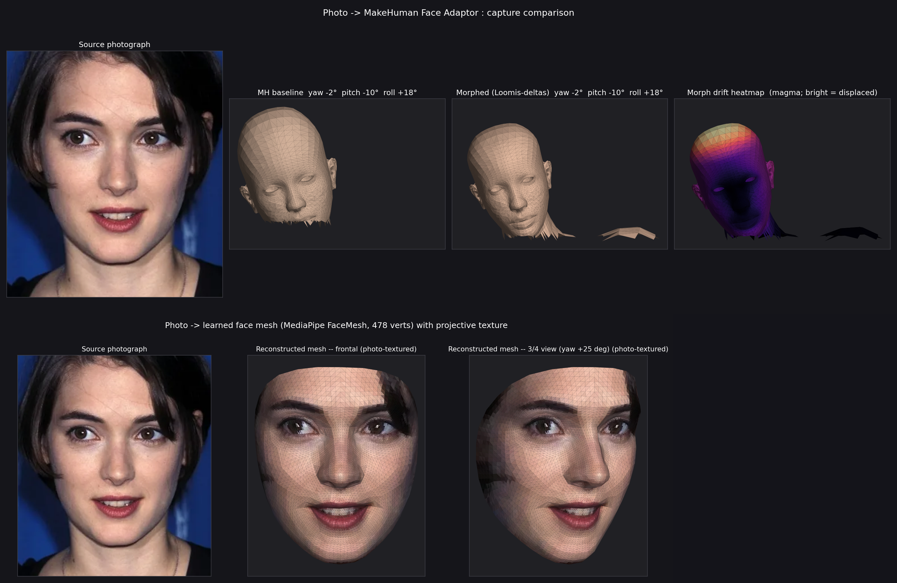

# DG Face Pipeline

End-to-end Python pipeline for `portrait photograph → 3D face mesh`, with two
parallel back-ends:

1. **Learned mesh** (recommended for likeness) — MediaPipe FaceMesh predicts
   478 3D landmarks from the photo, then writes the landmark positions through
   a reusable canonical topology. The default canonical is Google's 468-vertex,
   898-triangle MediaPipe face; the local v002 canonical keeps the same 468
   landmark index space but uses a quad-dominant 508-face layout
   (390 quads / 118 tris) for Maya Catmull-Clark tests. Output: a
   self-contained OBJ + UV-keyed projective texture from the source photo.
   ~3 seconds end-to-end on a CPU. No GPU, no FLAME/BFM license, no extra installs beyond
   `mediapipe + opencv-python + numpy + matplotlib`.

2. **MakeHuman-modifier path** (recommended for downstream MH rigging /
   animation) — extracts dimensionless Loomis / O'Reilly proportions from the
   photo, maps them onto nine MakeHuman shape modifiers, applies the weighted
   `.target` displacements to MH's 19,158-vertex base mesh, and emits a
   morphed body OBJ. The morph is honest but limited by how few modifiers we
   drive; the learned mesh is the one that looks like the subject.

The two back-ends run side-by-side in `run_full_pipeline.py` and produce a
stacked comparison frame so you can see them together.

The analyzer also emits a **canonical proportionality report**: classical
thirds/fifths are used as a measurement scaffold, then the subject's deltas
are charted. This is not a beauty score; it is the identity-offset map we can
later turn into MakeHuman `.target` sculpt data.

```
photo --> [analyzer] --> proportions JSON --> [step C] --> morphed MH OBJ
                              |
                              +----------> [render_canonical_report] --> canon PNG
                              |
                              +----------> [learned_face_mesh] --> dense OBJ + UVs
                              |
                              +----------> [render_face]        --> MH 4-panel PNG
                              |
                              +----------> [render_learned_mesh] --> learned 3-panel PNG
                                                                       |
                                                                       v
                                                              [stack_renders]
                                                                       |
                                                                       v
                                                          <subject>_full_pipeline.png
```

## Example output

The combined frame for `examples/winona_ref.png`:



Top half is the MakeHuman-modifier path (photo / baseline / Loomis-morphed /
drift heatmap). Bottom half is the learned-mesh path (photo / frontal
textured / 3/4 textured). Same data; two completely different mesh sources.

## Quickstart

### Prerequisites
- Windows 11 (only platform tested; nothing platform-specific in the code
  but `cv2.solvePnP` and `mediapipe` install cleanly on Win via pip)
- Python 3.10 or 3.11 (MediaPipe 0.10.x ships wheels for both)
- A local MakeHuman checkout at `..\makehuman\` (sibling to this directory)
  for the MH-modifier back-end. The learned-mesh back-end has no MH dependency.

### Install
```powershell
python -m pip install --upgrade pip
python -m pip install mediapipe==0.10.18 opencv-python==4.10.0.84 numpy==1.26.4 matplotlib==3.9.2
```

Optional, for `extract_depth_normal.py` (Depth Anything v2):
```powershell
python -m pip install torch torchvision transformers accelerate
```
A CPU-only install works fine (Depth Anything Base runs in ~3s on CPU);
CUDA-enabled torch gives ~0.3s per image on an RTX-class GPU. First
inference downloads the model checkpoint to your Hugging Face cache.

### Run the full pipeline -- drag-and-drop (easiest)
Drop a portrait image onto **`dg_face_pipeline\face_pipeline.bat`** in
Explorer. Slug is derived from the filename, outputs go to
`outputs\characters\<slug>\`. No CLI arguments required.

### Run the full pipeline -- CLI
```powershell
python dg_face_pipeline\run_full_pipeline.py --subject winona
```

By default, `--subject winona` reads
`dg_face_pipeline\examples\winona\ref.png`. The older flat
`examples\winona_ref.png` path is still accepted as a fallback, and you can
override with `--image <path>`.

Outputs land at:
- `dg_face_pipeline\outputs\characters\winona\data\winona_face_proportions.json`
- `dg_face_pipeline\outputs\characters\winona\data\winona_morphed.obj`        (MH-modifier path)
- `dg_face_pipeline\outputs\characters\winona\data\winona_face_mesh.obj`      (learned, with UVs)
- `dg_face_pipeline\outputs\characters\winona\renders\winona_canon_report.png`
- `dg_face_pipeline\outputs\characters\winona\renders\winona_mh_compare.png`
- `dg_face_pipeline\outputs\characters\winona\renders\winona_learned_mesh.png`
- `dg_face_pipeline\outputs\characters\winona\renders\winona_full_pipeline.png`  <- combined

### Export the Maya / Arnold handoff
```powershell
python dg_face_pipeline\learned_face_mesh.py --image dg_face_pipeline\examples\winona\ref.png --out dg_face_pipeline\outputs\characters\winona\data\winona_face_mesh.obj --canonical dg_face_pipeline\canonical_face_model_v002.obj --subdivisions 0
python dg_face_pipeline\export_maya_arnold_scene.py --subject winona --height-cm 22 --arnold-subdiv-type catclark --layout three --front-rotate-y 0
mayapy dg_face_pipeline\build_maya_arnold_scene.py --subject winona --arnold-subdiv-type none --arnold-subdiv-iterations 0 --bake-subdivision-levels 4
```

This stage is separate from analysis and mesh generation. It writes a
Maya-centimeter OBJ plus a fallback Maya ASCII Arnold loader scene under
`outputs\characters\<subject>\maya\`. The `mayapy` command then opens the local
lighting template, imports the normalized OBJ, creates a clean Arnold skin
shader network, lays out the three comparison meshes, applies Arnold
subdivision attributes or optionally bakes Catmull-Clark into real geometry,
and saves `<subject>_arnold_skin_clean.ma`. Rerun only these Maya stages when
shader, lighting, camera, smoothing, or scale settings change.

If a terminal does not yet see `mayapy`, call Maya 2027 directly:

```powershell
& "C:\Program Files\Autodesk\Maya2027\bin\mayapy.exe" dg_face_pipeline\build_maya_arnold_scene.py --subject winona
```

### Run only one back-end

Learned mesh + textured render (recommended for "show me the face"):
```powershell
python dg_face_pipeline\learned_face_mesh.py     --image examples\winona_ref.png --out outputs\data\winona_face_mesh.obj --subdivisions 2
python dg_face_pipeline\render_learned_mesh.py   --photo examples\winona_ref.png --mesh outputs\data\winona_face_mesh.obj --out outputs\renders\learned.png
```

Quad-dominant v002 learned mesh for Maya Catmull-Clark testing:
```powershell
python dg_face_pipeline\learned_face_mesh.py --image dg_face_pipeline\examples\winona\ref.png --out dg_face_pipeline\outputs\characters\winona\data\winona_face_mesh.obj --canonical dg_face_pipeline\canonical_face_model_v002.obj --subdivisions 0
```

MakeHuman-modifier path only:
```powershell
python dg_face_pipeline\face_proportion_analyzer.py --image examples\winona_ref.png --out outputs\data\proportions.json
python dg_face_pipeline\step_c_apply_modifiers.py   --proportions outputs\data\proportions.json --out_obj outputs\data\morphed.obj
python dg_face_pipeline\render_face.py              --photo examples\winona_ref.png --proportions outputs\data\proportions.json --morphed outputs\data\morphed.obj --out outputs\renders\mh.png
```

## Directory layout

```
dg_face_pipeline/
├── README.md                         <- you are here
├── face_proportion_analyzer.py        <- Step A+B: photo → ratios + pose JSON
├── step_c_apply_modifiers.py          <- Step C: ratios → morphed MH OBJ
├── learned_face_mesh.py               <- photo → learned dense OBJ + UVs
├── export_maya_arnold_scene.py        <- normalized Maya cm OBJ + fallback Arnold .ma
├── build_maya_arnold_scene.py         <- Maya 2027 clean scene builder
├── export_mediapipe_scaffold.py       <- point-only OBJ/CSV from MediaPipe verts
├── render_canonical_report.py         <- thirds/fifths overlay + delta chart
├── render_face.py                     <- 4-panel MH-modifier comparison render
├── render_learned_mesh.py             <- 3-panel learned-mesh + projective tex
├── generate_texture_maps.py           <- photo → albedo/roughness/normal JPGs (luminance-derived)
├── extract_depth_normal.py            <- photo → depth + true normals (Depth Anything v2)
├── segment_face_regions.py            <- split learned OBJ into lip/eye/brow/skin groups
├── face_pipeline.bat                  <- drag-and-drop entry point (auto slug from filename)
├── run_full_pipeline.py               <- orchestrator (analysis + renders, no Maya)
├── canonical_face_model.obj           <- vendored from google/mediapipe (Apache 2.0)
├── canonical_face_model_v002.obj      <- local quad-dominant canonical experiment
├── canonical_face_model_v002.ma/.mb   <- Maya source for the v002 canonical
├── examples/                          <- committed input portraits
│   ├── winona/ref.png
│   ├── subject_b/ref.png
│   ├── jim_varney/ref.png
│   ├── winona_ref.png                 <- legacy fallback
│   └── subject_b_ref.png              <- legacy fallback
├── outputs/                           <- generated artifacts (gitignored)
│   └── characters/<subject>/          <-   run_full_pipeline writes here
│       ├── data/                      <-     JSON + OBJs
│       ├── renders/                   <-     PNG comparison frames
│       ├── textures/                  <-     albedo/roughness/normal JPGs
│       └── maya/                      <-     Maya cm OBJ + .ma scenes
└── docs/
    ├── architecture.md                <- data flow + design decisions
    ├── cli_reference.md               <- every script flag
    ├── extending.md                   <- swap in MICA / add modifiers / new exporters
    ├── maya_handoff.md                <- Maya/Arnold lighting-template workflow
    ├── modifier_mapping.md            <- Loomis ratio ↔ MH modifier reference
    ├── pipeline_stages.md             <- what to regenerate and when
    ├── CLAUDE_HANDOFF.md               <- current Maya/v002 state for cold-start handoffs
    └── images/                        <- doc-embedded example frames
```

## Repo context

This pipeline lives **inside** a fork of MakeHuman Community
(<https://github.com/makehumancommunity/makehuman>) at
`makehumancommunity/makehuman` → `DeadlyGraphicsCG/makehuman`. The fork's
`feat/face-proportion-pipeline` branch is the active development branch.

The pipeline is **orchestrated by the DG_Brain hub**
(`C:\AI\apps\DG_Brain\`) — that's where production artifacts and per-subject
configurations live in the wider DG production stack. This `dg_face_pipeline/`
folder is the self-contained execution surface; DG_Brain is the conductor.

## Licensing

- Pipeline code (this folder, except canonical face model assets):
  inherits the parent repository's AGPL-3.0 from MakeHuman Community.
- `canonical_face_model.obj`: Apache-2.0, vendored verbatim from
  `google/mediapipe`, source at
  `mediapipe/modules/face_geometry/data/canonical_face_model.obj`.
- `canonical_face_model_v002.*`: local quad-dominant reconstruction experiment
  for the same MediaPipe 468-landmark face index space.
- Example portraits (`examples/`): third-party images, included for
  pipeline-demonstration purposes only. Replace with your own portraits for
  production use.
- MediaPipe (Python package) is Apache-2.0; OpenCV is Apache-2.0; matplotlib
  is PSF-style.

If commercial use is a constraint, the MakeHuman-modifier path is
AGPL-3.0-bound (because the MH `.target` files it reads are AGPL); the
learned-mesh path is fully Apache-2.0 in its dependency chain. See
`docs/extending.md` for how to detach the learned-mesh half from the MH fork
if needed.

## See also

- [docs/architecture.md](docs/architecture.md) — full data-flow walk-through
- [docs/cli_reference.md](docs/cli_reference.md) — every flag, every script
- [docs/extending.md](docs/extending.md) — adding modifiers, swapping
  reconstructor (MICA / PIXEL3DMM / FLAME), wiring back into MakeHuman
- [docs/maya_handoff.md](docs/maya_handoff.md) — Maya/Arnold scene handoff,
  lighting template, and shader map policy
- [docs/modifier_mapping.md](docs/modifier_mapping.md) — which MH modifier
  each Loomis ratio drives, with rationale
- [docs/pipeline_stages.md](docs/pipeline_stages.md) — staged regeneration
  rules for analyze / mesh / render / Maya exports
